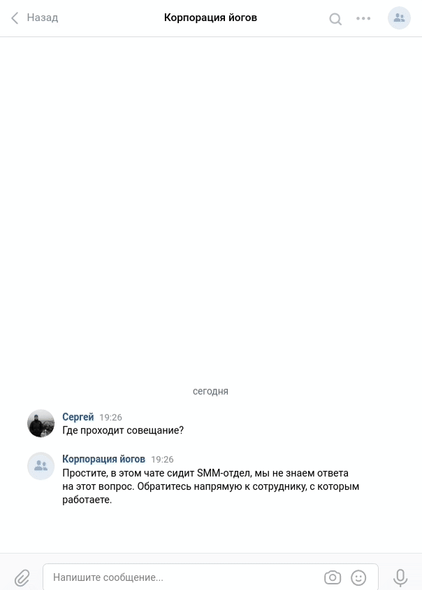

# Supportbot

Данные обучаемые нейросетью боты для мессенджера Телеграм и социальной сети ВКонтакте помогают службе поддержки отвечать на повторяющиеся вопросы. 
Использует DialogFlow API - это облачный сервис распознавания естественного языка от Google, который поддерживает различные языки, в том числе русский.

[Ссылка на телеграм-бот](t.me/dvmn_sa_support_bot)


[Ссылка на бот Вконтакте](https://vk.com/public206470549)


## Как установить
#### Этап 1. Локальный запуск
1. Создайте телеграм-бота - [Гайд по созданию телеграм-бота](https://core.telegram.org/bots#3-how-do-i-create-a-bot)
1. Создайте телеграм-бота для мониторинга - [Гайд по созданию телеграм-бота](https://core.telegram.org/bots#3-how-do-i-create-a-bot)
1. [Создать сообщество](https://vk.com/groups?tab=admin) Вконтакте или выбрать из уже созданных и разрешить отправку сообщений на вкладке "Сообщения"
1. Зарегистрируйтесь на [сайте](https://dialogflow.com/) сервиса Dialogflo
1. Создате нового агента — нашего бота в DiaologFlow
1. Создайте сервисный аккаунт и JSON-ключ [Гайд по созданию телеграм-бота](https://cloud.google.com/docs/authentication/getting-started)

1. Скачайте репозиторий командой
  
	`git clone https://github.com/SerhiiAlieksieiev/supportbot.git`
1. Сделайте виртуальное окружение командой
 
 	`python -m venv --copies /полный/путь/до/папки/виртуального/окружения `
1. Установите зависимости  командой 

	`py -m pip install -r requirements.txt`
1. Добавьте в начало кода `import dotenv`
   и в `def main():` `dotenv.load_dotenv('.env')`
1. Создайте questions.json файл с тренировочными фразама [Пример](https://dvmn.org/media/filer_public/a7/db/a7db66c0-1259-4dac-9726-2d1fa9c44f20/questions.json)
1. Запустите скрипт обучающий DialogFlow по API
    `python training.py`

1. Запустите ботов командами
    `python bot-tg.py`
    `python bot-vk.py`

#### Этап 2.  Деплой на Heroku

1. Зарегистрируйстесь на Heroku и создайте приложение

2. Опубликуйте свой код на GitHub

3. Во вкладке Deploy привяжите GitHub к аккаунту Heroku и нажмите Deploy Branch внизу страницы

4. Проверьте наличие файла [Procfile](https://devcenter.heroku.com/articles/procfile) с двумя строчкам:
	
    ```python
    bot-vk: python bot-vk.py
    bot-tg: python bot-tg.py
    ```

5. Добавьте переменные окружение во вкладке Settings на сайте Heroku
6. [Спрячьте ключи от гугл](https://stackoverflow.com/questions/47446480/how-to-use-google-api-credentials-json-on-heroku)
7. Скачайте Heroku CLI и добавьте [новый билдпак](https://github.com/gerywahyunugraha/heroku-google-application-credentials-buildpack)
8. Во вкладке Resources запуститете ботов
    
### Переменные окружения
Часть настроек проекта берётся из переменных окружения. Чтобы их определить, создайте файл `.env` рядом  с `main.py` и запишите туда данные в таком формате: ПЕРЕМЕННАЯ=значение.

 - TELEGRAM_TOKEN — токен для основного телеграм-бота можно узнать у [BotFarther](https://telegram.me/BotFather)
 - TELEGRAM_TOKEN_MONITORING — токен для сервисного телеграм-бота можно узнать у [BotFarther](https://telegram.me/BotFather)
 - CHAT_ID_MONITORING — персональный chat id, можно узнать у [userinfobot](https://telegram.me/userinfobot)
 - VK_TOKEN — токен для бота ВКонтакте, находится в меню “Работа с API”
 - GCP_PROJECT_ID — id проекта в dialogflow, который можно взять вкладке 'General' в поле 'Project ID'
 - GOOGLE_APPLICATION_CREDENTIALS — путь к json-файлу с ключом авторизации для dialogflow

### Цели проекта
Код написан в учебных целях — это урок в [курсе](https://dvmn.org/referrals/7KwCCiZMoG59b58rxb1wNonAoGgHJEMeQqVv6WeF/) по Python и разработке чат-ботов на сайте [Devman](https://dvmn.org/referrals/eC72w2BASG9Zj3T7iMTSsxDbHXthCmJmeLKBNfwf/).
